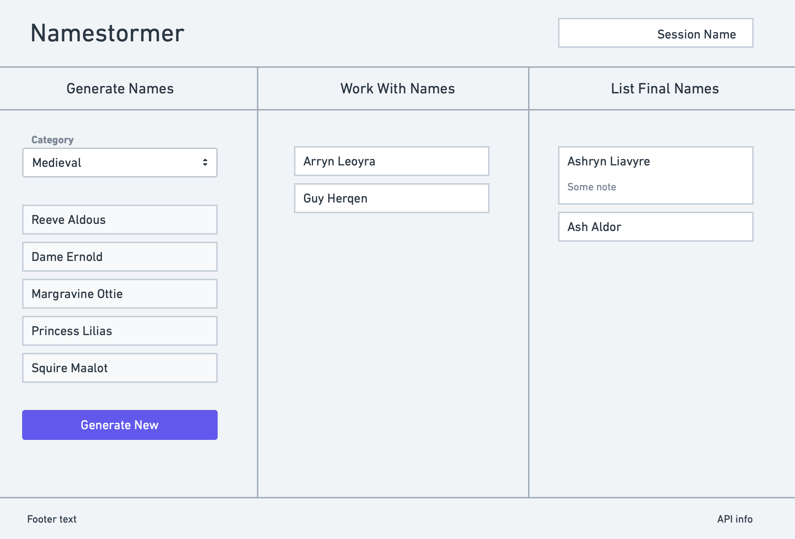
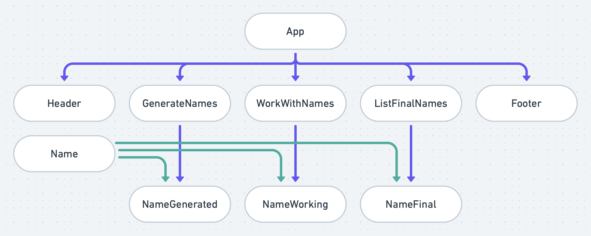

# Namestormer: Project Overview

## Project Name

The name of this project is *Namestormer*, which combines *name* and *brainstormer*.

## Project Description

As the name suggests, it is a way to brainstorm the naming of something. An API serves name suggestions that can then be chosen, edited, and sorted. Like you would brainstorm anything.

## Wireframe



## Component Hierarchy



## API and Data Sample

Fun Generators is used for name categories and names. Airtable is used for storing selected names.

```
{
  "success": {
    "total": null,
    "start": 0,
    "limit": 10
  },
  "contents": {
    "category": "elf",
    "variation": null,
    "names": [
      "Ashton Farsys",
      "Tiriara Yllazorwyn",
      "Tim Kelzeiros",
      "Ildilyntra Xyrzumin",
      "Robert Crajor",
      "Ashryn Luthyra",
      "Salihn Qinzeiros",
      "Syndra Carwynn",
      "Don Inaquinal",
      "Thaola Magra"
    ]
  },
  "copyright": "https:\/\/fungenerators.com\/"
}
```

## Project Schedule

|     Day     | Deliverable | Status
|-------------|-------------|--------
| Thu, Oct 22 | Prompt, idea Creation | Complete
| Fri, Oct 23 | Wireframe, component hierarchy, project approval | Complete
| Mon, Oct 26 | Core application structure, readme schedule/timeframes, API setup | Complete
| Tue, Oct 27 | Component architecture, Airtable setup, project deployment | Complete
| Wed, Oct 28 | CSS, MVP completion | Complete
| Thu, Oct 29 | Polish and stretch goals | Complete
| Fri, Oct 30 | Complete readme, presentations | Complete

## Timeframes

| Component | Priority | Estimated Time | Actual Time
|-----------|----------|----------------|-------------
| Wireframe, component hierarchy | M | 2hrs | 3hrs
| Core application structure | H | 2hrs | 4hrs
| API setup | H | 3hrs | 8hrs
| Airtable setup | H | 3hrs | 9hrs
| Component architecture | H | 8hrs | 10hrs
| CSS | L | 4hrs | 7hrs
| Project deployment | H | 2 hrs | 1hrs
| Readme | M | 1hr | 1.5hrs

## SWOT Analysis

### Strengths

Strong but simple idea with a lot of opportunities for growth in terms of additional features.

### Weakness

API has limitations and caches without the option to not cache, so will have to load a lot of items initially from the API, then store locally, then cycle through them with subsequent clicks, I think. The current feature set is extremely limited because of trouble with the API.

### Opportunities

There is a lot of opportunity to add features and styles. The next feature this needs is the ability to delete items. After that, editing chosen items. Adding styles to be able to drag elements to reorder them would be neat as well.

### Threats

The API was difficult and extremely limited, and on top of that costs $5/month.
